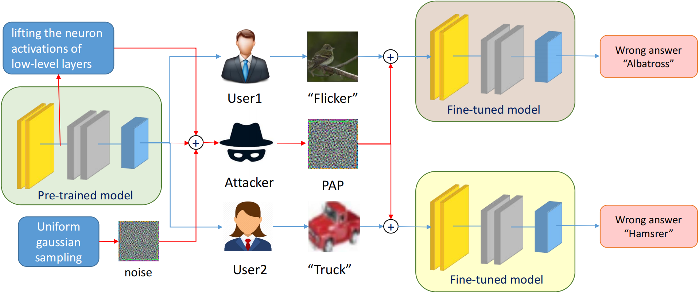

# Pre-trained Adversarial Perturbations
This repository contains the code for Pre-trained Adversarial Perturbations introduced in the following paper 
[Pre-trained Adversarial Perturbations](https://arxiv.org/abs/2210.03372) (Neurips 2022)

[Yuanhao Ban](), [Yinpeng Dong](https://ml.cs.tsinghua.edu.cn/~yinpeng/)

## Citation
If you find this paper useful in your research, please consider citing:

```
@inproceedings{
ban2022pretrained,
title={Pre-trained Adversarial Perturbations},
author={Yuanhao Ban and Yinpeng Dong},
booktitle={Thirty-Sixth Conference on Neural Information Processing Systems},
year={2022},
url={https://openreview.net/forum?id=ZLcwSgV-WKH}
}
```


## Introduction
In this paper, we delve into the robustness of pre-trained models by introducing Pre-trained Adversarial Perturbations (PAPs), which are universal perturbations crafted for the pre-trained models to maintain the effectiveness when attacking fine-tuned ones without any knowledge of the downstream tasks. 

To this end, we propose a Low-Level Layer Lifting Attack (L4A) method to generate effective PAPs by lifting the neuron activations of low-level layers of the pre-trained models. Equipped with an enhanced noise augmentation strategy, L4A is effective at generating more transferable PAPs against the fine-tuned models. Extensive experiments on typical pre-trained vision models and ten downstream tasks demonstrate that our method improves the attack success rate by a large margin compared to the state-of-the-art methods.



## Usage 
Clone this repo: ```git clone https://github.com/banyuanhao/PAP.git```

### Enviroment setup
```
python 3.8
Pytorch 1.8.1
Torchvision
tqdm
timm 0.3.2
```

### Datasets
Please download the [Imagenet](https://image-net.org/index.php), [CARS](https://ai.stanford.edu/~jkrause/cars/car_dataset.html), [PETS](https://www.robots.ox.ac.uk/~vgg/data/pets/), [FOOD](https://data.vision.ee.ethz.ch/cvl/datasets_extra/food-101/), [DTD](https://www.robots.ox.ac.uk/~vgg/data/dtd/), [CIFAR10](https://www.cs.toronto.edu/~kriz/cifar.html), [CIFAR100](https://www.cs.toronto.edu/~kriz/cifar.html), [FGVC](https://www.robots.ox.ac.uk/~vgg/data/fgvc-aircraft/), [CUB](http://www.vision.caltech.edu/visipedia/CUB-200-2011.html), [SVHN](http://ufldl.stanford.edu/housenumbers/), [STL10](https://cs.stanford.edu/~acoates/stl10/) datasets and put them in a folder. 
Please use ***--data_path*** to configure it.

### Models
The repo needs the pre-trained models and the fine-tuned ones.

To get SimCLRv2 pre-trained models, please follow this [repo](https://github.com/Separius/SimCLRv2-Pytorch) to convert the tensorflow models provided [here](https://github.com/google-research/simclr) into Pytorch ones. Please download MAE pre-trained models from [here](https://github.com/facebookresearch/mae).

To finetune models on downstream datasets, please follow this [repo](finetuning/SimCLR/README.md)

Please configure the paths of pre-trained and finetuned models in [tools.py](tools.py).


### Attacking
We provide the testing code of sereval baselines [STD](https://openaccess.thecvf.com/content_CVPR_2020/papers/Lu_Enhancing_Cross-Task_Black-Box_Transferability_of_Adversarial_Examples_With_Dispersion_Reduction_CVPR_2020_paper.pdf), [SSP](https://arxiv.org/abs/2006.04924), [FFF](https://arxiv.org/abs/1707.05572), [UAP](https://arxiv.org/abs/1610.08401), [UAPEPGD](https://ieeexplore.ieee.org/abstract/document/9191288/). 
We omit [ASV](https://arxiv.org/abs/1709.03582) bacause it can hardly be integrated into the framework. Anyone interested in it may download the official code and have a try.

Performing L4A<sub>base</sub> on Resnet50 pretrained by SimCLRv2. 
```
python attacks.py --mode l4a_base --model_name r50_1x_sk1 --model_arch simclr --data_path your_data_folder --target_layer 0 --save_path your_save_path
```

Performing L4A<sub>ugs</sub> on ViT-B pretrained by MAE.
```
python attacks.py --mode l4a_ugs --model_name vit_base_patch16 --data_path your_data --mean_std uniform --mean_hi 0.6 --mean_lo 0.4 --std_hi 0.10 --std_lo 0.05 --lamuda 0.01 --save_path your_save_path
```

Performing SSP on Resnet50 pretrained by SimCLRv2. 
```
python attacks.py --mode ssp --model_name r50_1x_sk1 --model_arch simclr --data_path your_data_folder --save_path your_save_path
```

Note: if you want to perform UAP or UAPEPGD on MAE models, you have to obtain models that linearprobes on the Imagenet.
Please refer to the [MAE repo](https://github.com/facebookresearch/mae).

### Evaluating
Testing PAPs on Resnet101
```
python eval.py --model_name r50_1x_sk1 --model_arch simclr --uap_path your_pap_path
```

## Fintuned models
We provide several finetuned models on the shelf. Please check the following table.

|  SimCLRv2   | SimCLRv2  | MAE |
|  ----  | ----  | ----  |
| r50_1x_sk1  | r101_1x_sk1 | vit_base_patch16 |

Due to the size of the fine-tuned models, we do not upload them to the cloud. Please download the models from the [link](https://cloud.tsinghua.edu.cn/d/796d38871dee46178c8b/).
If you feel interested in them, please email me at **banyh2000 at gmail.com**, and I will send you a copy. 

We also provide several perturbations in the [perturbations folder](perturbations).

## Acknowledgements
* This repo is based on the [SimCLRv2 repo](https://github.com/google-research/simclr), [SimCLRv2-Pytorch repo](https://github.com/Separius/SimCLRv2-Pytorch) and [MAE repo](https://github.com/facebookresearch/mae).

* Thanks to [UAP repo](https://github.com/NetoPedro/Universal-Adversarial-Perturbations-Pytorch), [FFF repo](https://github.com/val-iisc/fast-feature-fool). We steal many lines of code from them.

## Contact
```
banyh2000 at gmail.com  
dongyinpeng at gmail.com
```

Any discussions, suggestions and questions are welcome!
